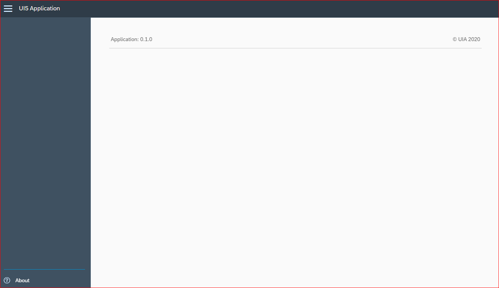

OpenUI5 Application Template
===

## Description

The goal of this archetype is to create a empty OpenUI5 project. 

The structure of the project is based on [UI5Lab-app-simple](https://github.com/UI5Lab/UI5Lab-app-simple) which is the best practice to build a OpenUI5 application.



## Setup

Run the following commands to create a UI5 project:

1. Install node.js (get it from [nodejs.org](http://nodejs.org/)).

2. Create a project using this archetype.

3. Install all npm dependencies (also installs all bower dependencies)
	```bash
	npm install
	```

4. Start a local web server for development

	```bash
	npm start
	```

5. Click index.html to open the app


## Publish

The [UI5 tooling](https://github.com/SAP/ui5-tooling) creates an optimized app ready to be deployed on a web server.
There are three variants to create an optimized build in the ```dist``` folder included in this repository:

1. Build app and libraries (default)

	```bash
	npm run build
	```

2. Build app and switch to CDN bootstrap (demo)

	```bash
	npm run buildCDN
	```

3. Self-contained build (minimal)

	```bash
	npm run buildSelfContained
	```

## References

[UI5Lab](https://ui5lab.io/)

[UI5Lab-app-simple](https://github.com/UI5Lab/UI5Lab-app-simple)